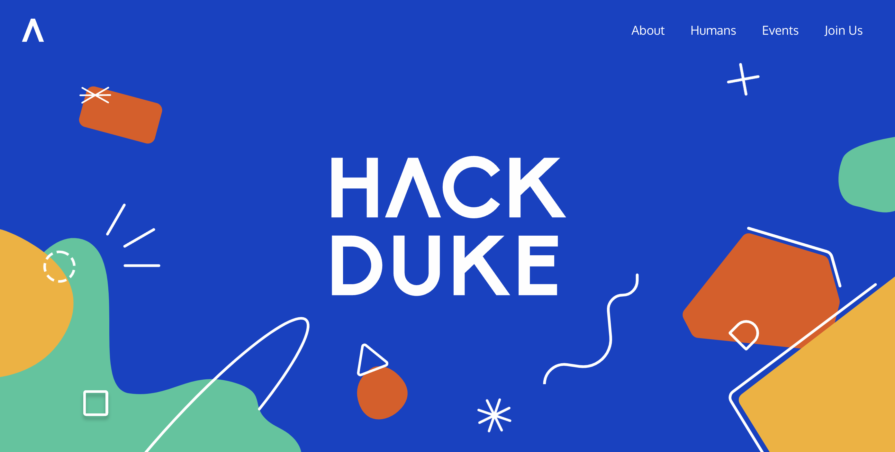

# Project 1: Design Journey

**For each milestone, complete only the sections that are labeled with that milestone.** Refine all sections before the final submission.

You are graded on your design process. If you later need to update your plan, **do not delete the original plan, leave it in place and append your new plan _below_ the original.** Then explain why you are changing your plan. Any time you update your plan, you're documenting your design process!

**Replace ALL _TODOs_ with your work.** (There should be no TODOs in the final submission.)

Be clear and concise in your writing. Bullets points are encouraged.

**Everything, including images, must be visible in _Markdown: Open Preview_.** If it's not visible in the Markdown preview, then we can't grade it. We also can't give you partial credit either. **Please make sure your design journey should is easy to read for the grader;** in Markdown preview the question _and_ answer should have a blank line between them.

## Personal Site (Milestone 1)

### Website Topic (Milestone 1)
> Briefly explain what your website will be about. Share your vision of your personal website.
>
My website will be a persoanl portfolio with coding projects and art that I have done throughout college in order to get an internship. It will provide information regarding my projects, my experiences, and some additional trivia about myself.

## Personal Website Design Exploration (Milestone 1)

Identify three personal websites (preferably static websites) that exist today on the web. You will be drawing inspiration from these sites for your own site; please select websites that are similar to the website you wish to create.

Include a screenshot of the home page for each site. If you're planning a mobile website, your screenshots should be from a mobile website. If you're planning a desktop website, your screenshots should be from a desktop website.

**We'll refer to these are your "example websites."**

1. <https://iris.design/>

    

2. <https://hackmit.org/>

    

3. <https://hackduke.org/>

    

### Personal Website 1 Review (Milestone 1)
> Review the personal website you identified above. (1-2 paragraphs)
>
> - Who do you think this site is designed for? Who is its intended audience?
> - What **goals** do you think the audience likely has when visiting this site.
> - What **content** is included?
> - Do you believe the content likely **addresses** the goals of the site's audience?
> - What do you like about the design?
> - Is the site designed for desktop, mobile, or desktop and mobile devices?

The website is designed for people that are interested in knowing Iris Li's previous design work experience. It's intended audience are probably recruiters trying to get to know her and her skills better. The goals is to examine Iris' personal portfolio and find whether she has matching skills for whatever they're looking for. The content addresses the goals as it showcases all her past works and descriptions of how she did it and what she's done. I like the minimalist design and how you can easily find everything you're looking for. It's made for desktop.

### Personal Website 2 Review (Milestone 1)
> Review the personal website you identified above. (1-2 paragraphs)
>
> - Who do you think this site is designed for? Who is its intended audience?
> - What **goals** do you think the audience likely has when visiting this site.
> - What **content** is included?
> - Do you believe the content likely **addresses** the goals of the site's audience?
> - What do you like about the design?
> - Is the site designed for desktop, mobile, or desktop and mobile devices?

The website is designed for people looking to participate in MIT's hackathon. The goals of the audience is to see what the event entails and what tracks they can participate in. The content includes more specific details about the event and companies that are sponsoring the event. I like the artsy graphic design layout and the naviation bar (which I believe can make you easily navigate through the site). It's made for desktop.

### Personal Website 3 Review (Milestone 1)
> Review the personal website you identified above. (1-2 paragraphs)
>
> - Who do you think this site is designed for? Who is its intended audience?
> - What **goals** do you think the audience likely has when visiting this site.
> - What **content** is included?
> - Do you believe the content likely **addresses** the goals of the site's audience?
> - What do you like about the design?
> - Is the site designed for desktop, mobile, or desktop and mobile devices?

The website is designed for people looking to participate in Duke's hackathon. The goals of the audience is to see what the event entails and what tracks they can participate in. The content includes more specific details about the event and companies that are sponsoring the event. I like the artsy graphic design layout and the naviation bar (which I believe can make you easily navigate through the site) -- it is quite similar to MIT's page but it has an overall different theme/design as its not quite illustrion based. It's made for desktop.

## Audience & Goals (Milestone 1)

Using what you learned from studying the example websites, identify your website's audience and their goals.

### Audience (Milestone 1)
> Briefly explain who the intended audience is for your website. Be specific and justify why this audience is appropriate for your site's topic.

The intended audience for my website is employers who're (hopefully) looking to hire me. Since I'll be showcasing my personal projects, employers can browse and assess the things I've worked on and decide whether my skills watch whatever it is they're looking for. The audience is appropriate for the topic as the website will provide more detailed information on my past experiences.

### Audience Goals (Milestone 1)
> Why would your audience visit your site?
> Identify at least 3 goals that your users have for visiting your website.

1. Getting to know me a little better aside from my resume.

2. Assess my skills through my personal projects.

3. (Hopefully) decide that I'm a good candidate through looking at my past work.

## Content Planning (Milestone 1)

Plan your site's content.

### Your Site's Planned Content (Milestone 1)
> List **all** the content you plan to include your personal website.
> You should list all types of content you planned to include (i.e. text, photos, images, etc.)

- Home page with an illustration I made
- About page with photo of myself and blurb of who I am
- Images of my digital/physical art
- Links to my personal github profile with projects
- Videos of the project's being executed
- Information about each project
- Informationa about each piece of art
- Contact information (email and phone)
- Link to my resume

### Content Justification (Milestone 1)
> Explain (about a paragraph) why this content is the right content for your site's audience and how the content addresses their goals.

It is the right choice as the text will convey the necessary information that the audience needs, while the images and videos will provide context for such information. Images can also make the website more aesthetic which can draw in the audience. The links provided will show the employers the code for various projects I've worked on and my resume.

### Home Page Content (Milestone 1)
> What is the content that your users would expect when visiting your site for the first time.
>
> Briefly identify what content you will include on the homepage and why this content should be the first thing your target audience sees when they visit your site.

The home page will just be an illustration of mine with my name big in the center and a navigation bar. The overall content would be an about me page, a page with my projects, a page with my art, and a link to my resume.

## Information Architecture (Milestone 2)

For milestone 2, you will design the information architecture for all the pages your website.

You may change your homepage content based on your card sorting. If you do change the homepage content, don't update it above, just include the new plan in the section below (Content Organization).

### Content Organization (Milestone 2)
> Document your **iterations** of card sorting here. You must have at least 2 iterations of card sorting.
> Include photographic evidence of each iteration of card sorting **and** description of your thought process for each iteration.
> Please physically sort cards; please don't try and do this digitally.

The content was sorted according to the list of pages in my navigation bar. I grouped the home image, my name title, and the short description together as those will be the elements of the home page. I grouped the photo of myself, my description, my personal timeline, and contact information together as that will go in my About page (where it's basically more detailed information about myself). I grouped project photos and project descriptions together as that will be content of the Projects page where I will showcase my personal projects. I grouped art photos and art descriptions together as that will be the content of the Art page where I will showcase my personal art. I grouped personal updates information and photography together since the photos are sometimes correlated in my updates and since that information is not strictly for professional purposes it will go in the Miscellaneous page. Lastly, the link to my resume is grouped on its own as that will be the only information on the Resume tab.

For this iteration, I changed the content to be slightly more specific in each category. For instance, I grouped art descriptions, art photos, and photography together under the Art page (photography was in Miscellaneous before) since photography is also a form of art. Since the Resume page gives information about my professional experience, I grouped resume, personal timeline information, and contact information under Resume instead.

### Final Content Organization (Milestone 2)
> Which iteration of card sorting will you use for your website?

I will be using the first iteration.

> Explain how the final organization of content is appropriate for your site's audiences.

It is a very clean and effective way of organizing information in groups that can serve as their own web pages. Each page has its own theme and purpose and users will find what they're looking for by clicking on the respective page they want. I chose iteration 1 over 2 as I believe the grouping in iteration 1 aligns more with what the pages represent.

### Navigation (Milestone 2)
> Please list the pages you will include in your website's navigation.

- Home
- About
- Projects
- Art
- Miscellaneous
- Resume

> Explain why the names of these pages make sense for your site's audience.

The names are straightforward and literal. "Home" is just the home page with my name as the title and a short description of myself. "About" is an about me page with a longer, more detailed description of who I am and ways to contact me. "Projects" showcases my personal projects. "Art" showcases my personal art. "Miscellaneous" gives fun little updates on my life and some non-professional side projects I've been doing in my daily life. "Resume" is an external link to my resume.

## Visual Themes (Milestone 3)

**Make the case for your decisions using concepts from class, as well as other design principles, theories, examples, and cases from outside of class.**

Remember to focus on the things we can't see just by looking at the site: changes, alternatives considered, processes, and justifications.

Each section is probably around 1 reasonably sized paragraph (2-4 sentences).

### Theme Ideas (Milestone 3)
> Discuss several (more than two) ideas about styling your site's theme. Explain why the theme ideas are appropriate for your target audiences.

Theme 1: Cool, slick, and professional
Since this is a personal portfolio directed to people interested mostly in my professional work and skills, it will be appropriate to have a cool/slick minimalistic theme as that gives off a more professional tone. This could give off a business-esque presentation (similar to company website designs) which is concise, easy to find information, and might attract recruiters.

Theme 2: Friendly and lighthearted
This could be an option so the website can captivate audiences by giving off a friendly and inviting atmosphere. If a site is friendly and welcoming, people might be more interested in browsing different tabs and checking out the websites features. A way to make it friendly for instance would be to use vibrant soft colors and use different kind of shapes and outlines to give off a playful, inviting feeling.

Theme 3: Minimalistic and artsy
Another option is to keep a minimalistic and artsy style. This is a style that is common in my artwork -- since it's a personal website that showcases my work, it would be a good idea to have a style that mimics my art/design style so that the audience can get a sense of what I do. Minimalistic design is aesthetically pleasing and can create a clean, uncluttered look that is visually appealing. This can draw users in and make them more likely to stay on the site. In addition, a well-executed minimalistic and artsy design can convey a strong and memorable brand identity. Users often associate such designs with professionalism and sophistication.

### Final Theme (Milestone 3)
> Which theme did you select as your final theme? Why?

Theme number 3. I'm choosing this theme because I believe it will more visually appealing and also showcase people who view my website what my art/design style is.

### Theme Rationale (Milestone 3)
> Discuss your final theme design: how do they fit your overall design goals and audiences?

As an artits, I believe that minimalistic designs work well for many artist and since this website is my personal portfolio it's essential that the design aligns with my personal style and the messages I wish to convey through my art. Since it's a portfolio, I believe the website should serve as an extension of my artistic expression and effectively communicate my vision with the audience which is why arty and minimalistic (which is similar to my own art style) is a perfect fit.

> Emotion is a big part of design. What emotions were you thinking about or trying to convey in your designs?

I wish to convey a playful and inviting emotion through my design. This will be done by using a bright pastel color palette and quirky illustrations to show a more lighthearted mood. 

## Composition (Final Submission)

### Home Page Composition (Final Submission)
> Include at least two sketches of possible composition ideas for the home page.
> Provide an explanation for each sketch explaining the idea.
> Show your design process.
> **Use the example websites above as inspiration for your site's design.**

TODO: composition sketches

### Final Site Design (Final Submission)
> Include a sketch of the final composition for each page in your site.
> Provide an explanation below each sketch.

TODO: site sketches

### Static Website Design Check (Final Submission)
> We're building a static website without interactivity.
> **No part of your website may dynamically change.**
> Examples of dynamic behavior are dropdown menus, hamburger menus, popups, modals/lightboxes, image carousels, etc.
>dfd
> Audit your design and check that you aren't relying on any dynamic features.

TODO: Explain why your site's design is completely static.

## Rationale (Final Submission)

**This rationale should be polished writing:** one you might submit as a report to a client or boss to help explain the project and convince them you did a good job. You'll be surprised how much writing and communicating you need to do about projects and choices on internships and jobs; practice that here.

It should be a comprehensive, complete story of the project. You might find that each section runs a few paragraphs (1-2). Sketches can often help tell the story of your design. Screenshots are also useful for describing issues discovered during the design process and how you addressed them.

**All images must be visible in "Markdown: Open Preview" for credit!**

Your rationale should be a polished version of the earlier explanations.

### Audience (Final Submission)
> A complete and polished description of the intended audience(s) for your website.

TODO: audience rationale

### Design Goals (Final Submission)
> An explanation of the design goals for that audience, based on your earlier rationales.

TODO: your design goals

### Content Organization & Navigation (Final Submission)
> An explanation of how the final content organization and navigation met your goals and why it's appropriate for your audience.

TODO: content and information architecture rationale

### Visual Design (Final Submission)
> An explanation of how the final design met your goals and why it's appropriate for your audience.

TODO: design rationale

### Self-Reflection (Final Submission)
> Take some time here to reflect on how much you've learned since you started this class. It's often easy to ignore our own progress. Take a moment and think about your accomplishments in this class. Hopefully you'll recognize that you've accomplished a lot and that you should be very proud of those accomplishments!

TODO: reflection

## Grading (Final Submission)

### Grading: Open the Design Journey in Markdown: Open Preview (Final Submission)
> Preview your design journey in VS Code. Please verify that this document is easy to read/grade.
>
> - Remove all _TODOs_
> - All images must be visible.
> - All images must be oriented the correct way.
> - There should be a blank line between the question prompt and your answer.
>
> Is your design journey easy to read?

TODO: design journey ready to grade?

### Collaborators
> List any persons you collaborated with on this project.

TODO: list your collaborators

### Resources
> Please cite any external resources you used in the creation of your project.

TODO: list resources
